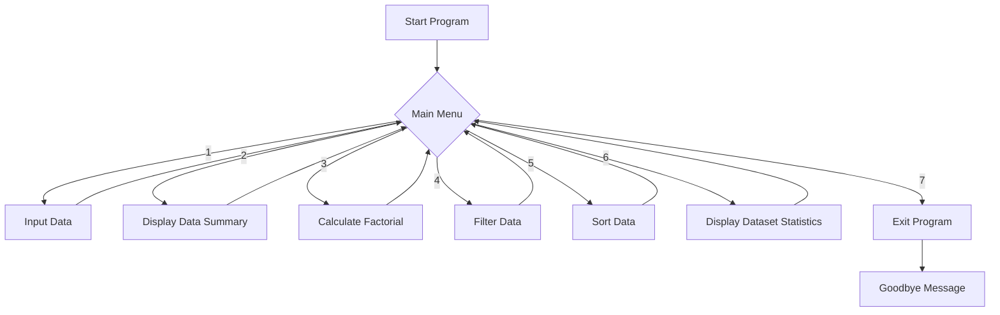

<div align="center">


<br/>


<br/><br/>

<p>
  
  
  
  
</p>

<p>
  
  
  
</p>


</div>

<br/>

## 📋 Table of Contents

- [About the Project](#-about-the-project)
- [Why This Project](#-why-this-project)
- [Demo Video](#-demo-video)
- [Features](#-features)
- [Tech Stack](#-tech-stack)
- [Project Structure](#-project-structure)
- [Program Flow](#-program-flow)
- [Getting Started](#-getting-started)
- [How It Works](#-how-it-works)
- [Function Reference](#-function-reference)
- [Concepts Demonstrated](#-concepts-demonstrated)
- [What I Learned](#-what-i-learned)
- [FAQ](#-faq)
- [Contributing](#-contributing)
- [Author](#-author)
- [License](#-license)

<br/>

## 📖 About the Project

<div align="center">

</div>

**Data Analyzer and Transformer** is a menu-driven Python console application built to demonstrate a full spectrum of **functional programming concepts** in a single, cohesive tool. Rather than writing isolated snippets for each concept, this project ties them all together into something genuinely usable: a program that takes raw **1D** and **2D** numeric data and lets you **analyze**, **filter**, and **sort** it interactively.

This project was built as part of the **"Functional Treat"** assignment at **Red and White Skill Education**, where the brief was to demonstrate proficiency in built-in functions, user-defined functions, `*args`/`**kwargs`, `__doc__`, recursion, lambda functions, the `global` keyword, and sorting — all inside one menu-driven interface. Every one of those requirements is implemented here, function by function, and documented so the code explains itself as you read it.

<div align="center">

</div>

<br/>

## 🎯 Why This Project

<div align="center">

</div>

Most beginner Python exercises demonstrate one concept in isolation — a lambda here, a recursive function there. This project was intentionally designed differently: **every concept had to earn its place inside a real workflow.**

- 🧩 Instead of a toy recursion demo, factorial calculation is a genuine menu option a user might reach for.
- 🧹 Instead of a standalone lambda example, filtering is wired directly into the dataset the user just entered.
- 📊 Instead of printing stats once, `*args`/`**kwargs` power a flexible statistics function that can grow without breaking its signature.

The goal was to end up with something that feels like a **small, real analytics tool** — not a checklist of syntax examples.

<div align="center">

</div>

<br/>

## 🎥 Demo Video

<div align="center">


<!-- 🎬 Paste your demo video link below once it's ready — YouTube link works great here! -->
<!-- Example: [](https://www.youtube.com/watch?v=VIDEO_ID) -->

> 🎬 **Demo video!** —  https://drive.google.com/file/d/1rvfsT3jB0MC5_rlhhbVolmO05Nwe7jUJ/view?usp=sharing


</div>

<br/>

## ✨ Features

<div align="center">

</div>

<table>
<tr>
<td width="50%" valign="top">

### 🧮 Data Handling
- 📥 Input **1D** or **2D** array data
- 📊 Instant dataset summary (min, max, sum, avg)
- 🔁 Recursive factorial calculator
- 🧹 Filter data above/below a threshold with `lambda`

</td>
<td width="50%" valign="top">

### ⚙️ Under the Hood
- 🧩 User-defined functions for every task
- 📌 `global` keyword for shared state
- 🎒 `*args` and `**kwargs` powered statistics
- 🔀 Ascending / Descending sorting
- 📚 `__doc__` powered self-describing menu

</td>
</tr>
</table>

<div align="center">

</div>

<br/>

## 🛠 Tech Stack

<div align="center">

</div>

<div align="center">
  
</div>

<div align="center">

</div>

<br/>

## 📂 Project Structure

<div align="center">

</div>

```
Functional-Treat-RedandWhite-Python/
│
├── Functional Treat/
│   └── index.py        # Main program — all logic lives here
│
└── README.md            # You are here 👋
```

<div align="center">

</div>

<br/>

## 🔄 Program Flow

<div align="center">

</div>



<div align="center">

</div>

<br/>

## 🚀 Getting Started

<div align="center">

</div>

### Prerequisites
- Python **3.10+** installed (uses `match-case`, added in 3.10)

### Installation

```bash
# 1. Clone the repository
git clone https://github.com/PalAnghan/Functional-Treat-RedandWhite-Python.git

# 2. Move into the project folder
cd "Functional-Treat-RedandWhite-Python/Functional Treat"

# 3. Run the program
python index.py
```

<div align="center">

</div>

<br/>

## 🧭 How It Works

<div align="center">

</div>

The program boots into a **main menu** loop where you choose a numbered option:

```
Main Menu:
1. Input Data
2. Display Data Summary (Built-in Functions)
3. Calculate Factorial (Recursion)
4. Filter Data by Threshold (Lambda Function)
5. Sort Data
6. Display Dataset Statistics (Return Multiple Values)
7. Exit Program
```

Each option maps to a dedicated function, documented inline with a `__doc__` string that's printed the moment you select it — so the tool literally explains itself as you use it. Data lives in two module-level containers, `OneDArray` and `TwoDArray`, accessed through the `global` keyword so every function can read and update the same dataset without passing it around manually.

<div align="center">

</div>

<br/>

## 📚 Function Reference

<div align="center">

</div>

| Function | Purpose | Key Concept |
|---|---|---|
| `input_data()` | Prompts the user for 1D or 2D data and stores it globally | `global`, built-in `input()`/`map()` |
| `display_data()` | Prints a full summary of whichever dataset is stored | Built-in functions (`len`, `min`, `max`, `sum`) |
| `calculate_factorial(n)` | Computes `n!` by calling itself | Recursion |
| `filter_data()` | Removes values below a user-given threshold | Lambda + `filter()` |
| `sort_data()` | Sorts the stored dataset ascending or descending | `sorted()` |
| `display_dataset(*args, **kwargs)` | Prints a flexible statistics summary | `*args`, `**kwargs`, `__doc__` |

<div align="center">

</div>

<br/>

## 🧠 Concepts Demonstrated

<div align="center">

</div>

| Concept | Where It's Used |
|---|---|
| **Built-in Functions** | `len()`, `sum()`, `min()`, `max()` for instant stats |
| **User-Defined Functions** | Every menu option is its own dedicated function |
| **`*args` and `**kwargs`** | `display_dataset()` for flexible statistics printing |
| **`__doc__`** | Every function self-documents inside the menu |
| **Recursion** | `calculate_factorial()` |
| **Lambda Functions** | Threshold filtering with `filter()` |
| **`global` keyword** | Shared `OneDArray` / `TwoDArray` state across functions |
| **Sorting** | `sorted()` with ascending/descending toggle |
| **1D and 2D Collections** | `array` module for 1D, nested lists for 2D |

<div align="center">

</div>

<br/>

## 💡 What I Learned

<div align="center">

</div>

Building this project reinforced a handful of ideas that don't fully click until you've wired them into something real:

- **`global` is a tool, not a habit** — using it here made clear why large programs eventually move to classes or explicit state passing.
- **Lambdas shine in `filter()`/`map()` pipelines** — a one-line condition kept the filtering logic readable instead of writing a full function for a simple check.
- **`*args`/`**kwargs` are about flexibility, not cleverness** — they let `display_dataset()` accept extra labels or metadata later without changing its signature.
- **Recursion needs a firm base case** — `calculate_factorial()` made the importance of the `n == 0 or n == 1` guard very concrete.

<div align="center">

</div>

<br/>

## ❓ FAQ

<div align="center">

</div>

<details>
<summary><b>Why does the 2D array input always ask for exactly 3 rows?</b></summary>
<br/>
The assignment scope fixed the 2D dataset at 3 rows to keep the console interaction predictable. It's a natural next step to make this user-configurable.
</details>

<details>
<summary><b>What Python version do I need?</b></summary>
<br/>
Python 3.10 or newer — the main menu uses <code>match-case</code>, which was introduced in 3.10.
</details>

<details>
<summary><b>Can I extend this with a GUI later?</b></summary>
<br/>
Yes — the core logic in each function is already separated from the menu loop, so wiring it up to a GUI framework or web frontend later is straightforward.
</details>

<div align="center">

</div>

<br/>

## 🤝 Contributing

<div align="center">

</div>

Contributions, issues, and feature requests are welcome!

```bash
1. Fork the project
2. Create your feature branch (git checkout -b feature/AmazingFeature)
3. Commit your changes (git commit -m 'Add some AmazingFeature')
4. Push to the branch (git push origin feature/AmazingFeature)
5. Open a Pull Request
```

<div align="center">

</div>

<br/>

## 👤 Author

<div align="center">


### **Pal Anghan**


<br/>

<p>
  <a href="https://www.linkedin.com/in/pal-anghan"></a>
  <a href="https://github.com/PalAnghan"></a>
</p>

</div>

<div align="center">

</div>

<br/>

## 📄 License

<div align="center">

</div>

This project is licensed under the **MIT License** — feel free to use, modify, and learn from it.

<br/>

<div align="center">

### ⭐ If this project helped you, consider giving it a star!


</div>
